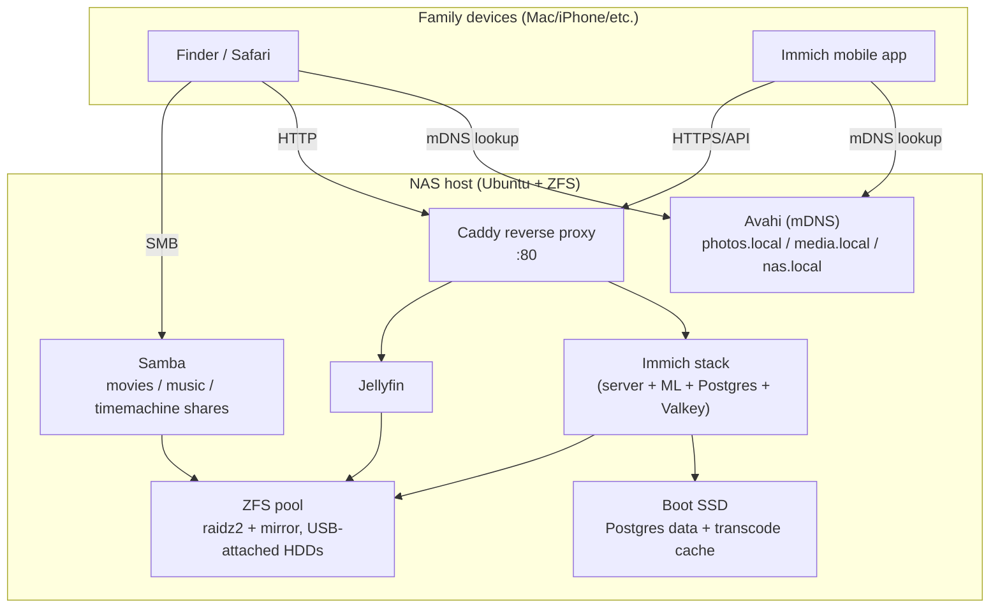

# FamilyNAS

A self-hosted family NAS built on commodity hardware: a private Apple Photos/iCloud
replacement (Immich), a movie/music server (Jellyfin), and a Samba file share for
easy uploads from Mac/Windows clients — all reachable by plain, memorable
hostnames instead of `hostname:port` URLs.

This repo documents the actual build: the hardware, the architecture decisions
(and the ones we got wrong the first time), step-by-step setup instructions, and
every gotcha we hit along the way. It's written so a friend with similar spare
hardware can follow along and end up with the same result.

The reverse-proxy/mDNS layer described here isn't limited to the two apps above
— it was built to be extended. Adding another self-hosted app later is just
one more Caddy site block and one more `<name>.local` alias (see
[`docs/setup-guide.md`](docs/setup-guide.md#5-reverse-proxy-friendly-urls)); we
already run a few other things this way on our own box.

### A note on naming

Our own server is called `igorbot` on our LAN — an arbitrary, personal choice
with no significance beyond "that's what we named it." Every hostname in this
repo (`nas.local`, `photos.local`, `media.local`, etc.) is a generic
placeholder for the guide, not a name you're expected to reuse. Name yours
whatever you want; nothing here depends on the specific name, only on being
consistent about it across your own Caddyfile, Samba config, and mDNS aliases.

## What's in the stack

| App | Purpose | URL (example) |
|---|---|---|
| [Immich](https://immich.app/) | Photo/video library, Apple Photos replacement, mobile auto-backup | `http://photos.local` |
| [Jellyfin](https://jellyfin.org/) | Movies & music streaming | `http://media.local` |
| Samba (`smbd`) | Family upload access from Finder/Explorer | `smb://nas.local` |
| [Caddy](https://caddyserver.com/) | Reverse proxy — turns ports into names | `http://nas.local` |

## Architecture at a glance

See [`docs/architecture.md`](docs/architecture.md) for the full reasoning behind
every one of these choices — most of them exist because an earlier, more "obvious"
approach broke in a specific way.

## Getting started

1. Read [`docs/architecture.md`](docs/architecture.md) first — it explains *why*
   the stack is shaped this way, which matters more than the exact commands if
   your hardware differs from ours.
2. Follow [`docs/setup-guide.md`](docs/setup-guide.md) for the actual build,
   start to finish.
3. Keep [`docs/troubleshooting.md`](docs/troubleshooting.md) open — it documents
   every non-obvious failure we hit (Docker's silent bind-mount behavior, two
   separate Avahi/mDNS bugs, a JavaScript falsy-string trap, Immich's reverse-proxy
   limitations) so you don't have to debug them from scratch.
4. Reusable config templates (docker-compose, Caddyfile, Samba shares, systemd
   units) live in [`config/`](config/) — copy and adapt, don't copy-paste blindly.

## Reference hardware

This was built on an Intel NUC7i5BNH (dual-core, 16GB RAM) with a TerraMaster
D6-320 USB DAS enclosure and a mix of 8TB/4TB drives — deliberately modest,
already-owned hardware rather than a from-scratch purchase. See
[`docs/architecture.md`](docs/architecture.md#hardware) for why this hardware
shapes several of the design decisions (no Thunderbolt/USB-C, limited RAM, mixed
drive sizes).

## License

MIT — see [`LICENSE`](LICENSE). Use this however's useful to you; no warranty,
this is a documented home lab, not a product.
